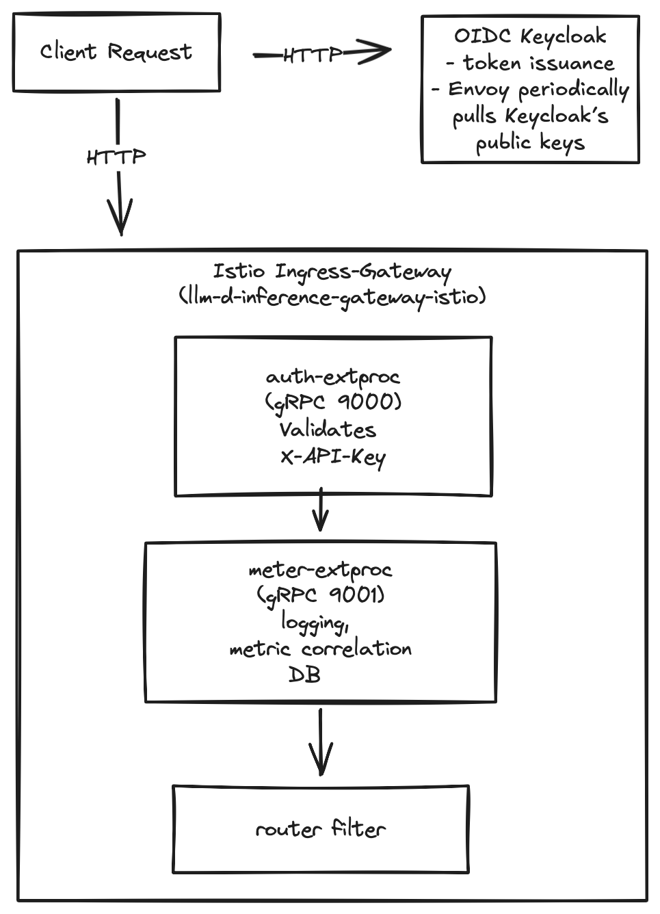

# auth-extproc


## Overview

This repo bolts **static-key authentication** and **per-request metering** onto a **llm-d** deployment without touching the model servers themselves. All enforcement happens **in the network path** at the Istio ingress-gateway. For demo purposes, this is using static key:UIDs. This would be backed by an OIDC provider like Keycloak.

| Layer                | Component                               | What happens                                                                                                                                                                                                                                                |
| -------------------- | --------------------------------------- |-------------------------------------------------------------------------------------------------------------------------------------------------------------------------------------------------------------------------------------------------------------|
| **Client → Gateway** | `llm-d-inference-gateway-istio` (Envoy) | A user sends a request (`/v1/models`, `/v1/completions`, …).                                                                                                                                                                                                |
| **HTTP filter #1**   | **auth-extproc** (gRPC)                 | Envoy streams the request headers to *auth-extproc*. It validates the `X-API-Key` against a Kubernetes `Secret`. <br>• **valid** → returns *“continue”* <br>• **invalid/missing** → returns *“denied”* → Envoy replies **401** to the client.               |
| **HTTP filter #2**   | **meter-extproc** (gRPC)                | For successful requests, Envoy buffers the **response body** and sends it to *meter-extproc*. The service parses the JSON, counts prompt & completion tokens, and (for now) holds them in memory; later you can back it with Redis/Postgres or enforce quotas. |
| **Upstream**         | vLLM / EPP pods                         | If auth passes, Envoy forwards the request to the normal llm-d routing stack (Endpoint Picker ➜ vLLM decode/prefill).                                                                                                                                       |
| **Downstream**       | Client                                  | After meter-extproc returns “continue”, Envoy releases the (possibly streamed) model response to the caller.                                                                                                                                                |

### How it plugs into llm-d

* **No code changes to llm-d** — everything is done with an **EnvoyFilter** that patches the gateway’s HTTP filter chain:
  `auth-extproc → meter-extproc → router`.
* **Sidecars in the two ext-proc pods** mean they speak Istio mTLS just like every other workload in the mesh.
* **Clusters** (`auth-extproc-cluster`, `meter-extproc-cluster`) are auto-generated in the same filter, so Envoy knows how to reach the processors.

<p align="center">
  
</p>

### Lifecycle of a successful request

Here is the lifecycle of a successful request:

- Envoy receives the incoming HTTP request and immediately opens a single gRPC/HTTP-2 stream to your auth-proc service (one stream per request).
- auth-proc reads the headers only, checks the X-API-Key against the in-memory map (or Secret/DB), and logs for example: ALLOW: Valid API key for user mittens found.
- The processor replies with an EXT_PROC “continue” message. No body data is copied, so this round-trip is just a few hundred bytes.
- Envoy gets the “continue” signal, falls through to the next HTTP filter (meter-proc) and then straight to the router inside the same ingress-gateway pod. Your auth-proc’s work is done for this request; it simply waits on stream.Recv() for the next one.
- The request is now routed, untouched, to llm-d’s normal path → Endpoint Picker (EPP) → InferencePool Service → vLLM decode/prefill pod over plain HTTP/2 (h2c). There is no extra serialization, proxy hop, or TLS termination added by the ext-proc filters, so the model sees the exact same payload it would without metering.
- Typical latency overhead for both ext-proc calls is < 2 ms on a local cluster, dominated by a single gRPC header frame; throughput remains limited only by vLLM itself.
- When the model response flows back, Envoy buffers or streams the body to meter-proc (depending on response_body_mode). meter-proc counts tokens and returns “continue”; because failure_mode_allow: true, any lag or crash in meter-proc is ignored and the response is released immediately to the client.
- After the client has received the full response, Envoy closes the gRPC stream it opened in step 1, freeing resources on both sides; auth-proc’s blocking stream.Recv() returns an EOF and the for-loop spins for the next request.

> Net effect: authentication and metering add only micro-seconds of in-gateway processing while leaving the high-bandwidth path between the ingress-gateway and llm-d unchanged.

### Quotas & failure behaviour

* **Auth** uses `failure_mode_allow: false` — if the processor crashes or times-out, the request is blocked.
* **Meter** is `failure_mode_allow: true` — usage accounting should never break the API; if it’s down, traffic still flows.
* Token counts are printed to the pod log; swap out the in-memory map for a real DB and you can enforce per-user or per-key quotas.

> Components: running llm-d stack, apply a manifest + two lightweight Go services that demos a
> key-based access control *and* usage metering, all hot-reloaded by Istio.

````markdown
# llm-d static-key auth + metering (Istio / Envoy ext-proc)

> One-shot guide for generating API keys, building/pushing the
> `auth-extproc` and `meter-extproc` images, applying the manifests, and
> validating that the gateway enforces keys and counts tokens.

---

## 1  Generate two user API keys (Demo, Mittens); Replace with Keycloak backing

- Start an instance of [llm-d](https://github.com/llm-d/llm-d-deployer/blob/main/quickstart/README-minikube.md)
- Setup demo users:

```bash
# one-time key generation
export KEY_DEMO=$(openssl rand -hex 32)
export KEY_MITTENS=$(openssl rand -hex 32)

echo "Demo   : $KEY_DEMO"
echo "Mittens: $KEY_MITTENS"
````

---

## 2  Apply the static-key manifest

> Substitute the placeholders in the YAML and apply.

```bash
sed -e "s/__REPLACE_WITH_KEY_DEMO__/$KEY_DEMO/"   \
-e "s/__REPLACE_WITH_KEY_MITTENS__/$KEY_MITTENS/" \
metering-static-keys-istio.yaml \
| kubectl apply -f -
```

If you keep a local copy (`metering-static-keys-istio.yaml`), delete the
old Secret first:

```bash
kubectl delete -f metering-static-keys-istio.yaml --ignore-not-found
kubectl apply  -f metering-static-keys-istio.yaml
```

---

## ext-proc containers

###  `auth-extproc`

Currently, all logic is here.

###  `meter-extproc`

Note: Need to get the metadata from auth-extproc update correctly passed to the meter service, so I collapsed the quota into the `auth-extproc` service

---

## Roll out the components in the cluster

```bash
# restart the ingress-gateway to pick up the latest EnvoyFilter config
kubectl -n llm-d rollout restart deploy/llm-d-inference-gateway-istio

# restart the two ext-proc deployments so the new images pull
kubectl -n llm-d rollout restart deploy/auth-extproc
kubectl -n llm-d rollout restart deploy/meter-extproc
```

---

## 5  Validate end-to-end

### 5.1  Port-forward the gateway

```bash
kubectl -n llm-d port-forward svc/llm-d-inference-gateway-istio 8080:80
```

### 5.2  Call `/v1/models` with a valid key

```bash
curl -v http://localhost:8080/v1/models \
  -H "X-API-Key: $KEY_MITTENS"
```

- Expected

```shell
2025/07/02 06:47:57 Loaded 4 API keys.
2025/07/02 06:47:57 auth-extproc listening on :9000
2025/07/02 06:48:37 ALLOW: Request 1/5 for user 'mittens'.
2025/07/02 06:48:41 ALLOW: Request 2/5 for user 'mittens'.
2025/07/02 06:48:54 ALLOW: Request 3/5 for user 'mittens'.
2025/07/02 06:48:58 ALLOW: Request 4/5 for user 'mittens'.
2025/07/02 06:48:59 ALLOW: Request 5/5 for user 'mittens'.
2025/07/02 06:49:02 DENY: Quota exceeded for user 'mittens'.
```

- Or if the user is not authorized:

```shell
2025/07/02 06:49:14 DENY: Request with missing or invalid API key.
```

- Tail the processors

```bash
kubectl -n llm-d logs -f deploy/auth-extproc
kubectl -n llm-d logs -f deploy/meter-extproc
```

Then trigger a completion to see token accounting:

```bash
curl -s http://localhost:8080/v1/completions \
-H "X-API-Key: $KEY_BRENT" \
-H "Content-Type: application/json" \
-d '{"model":"<your-model-id>","prompt":"Hello"}' | jq .
```

---

##  Mental model – Istio + EnvoyFilter

* **EnvoyFilter CRD** edited the gateway’s HTTP filter chain **in place**;
  Istio pushes changes live with no pod restarts.
* **`failure_mode_allow`** is `false` for auth (block on error), `true`
  for meter (never block user traffic).
* Sidecars were injected into both ext-proc pods so mTLS works
  transparently in a default STRICT mesh.
